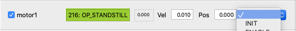
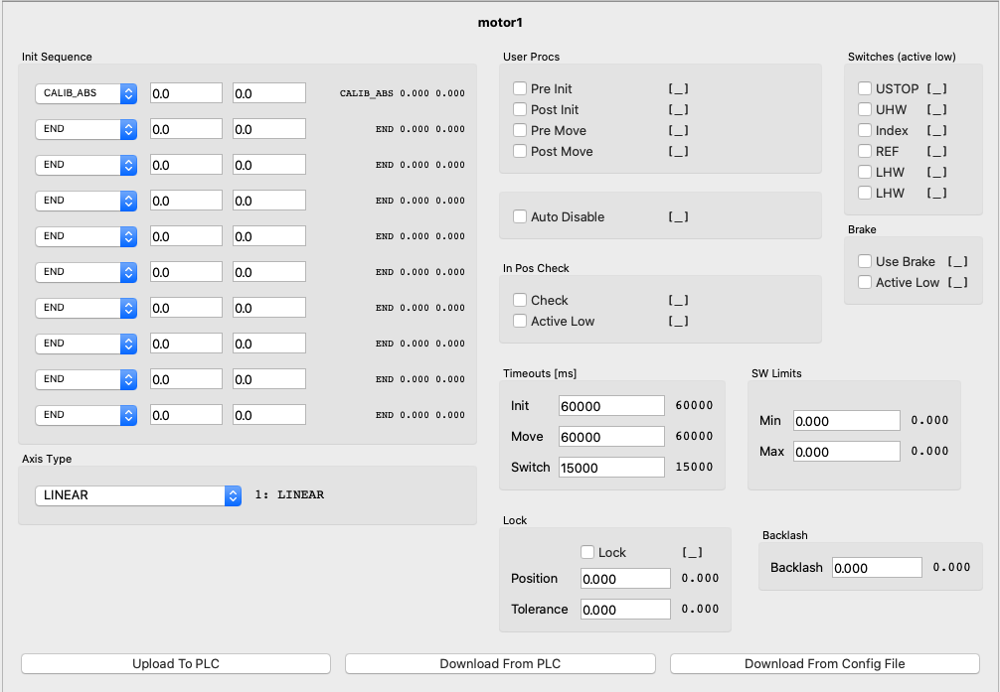
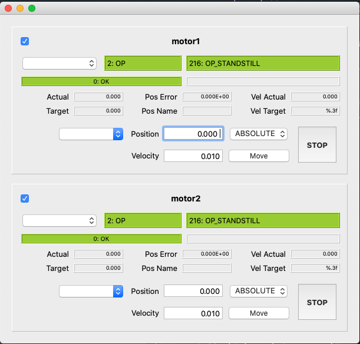
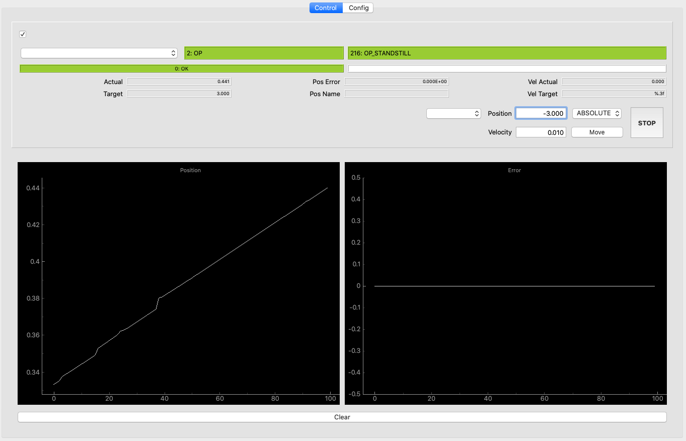
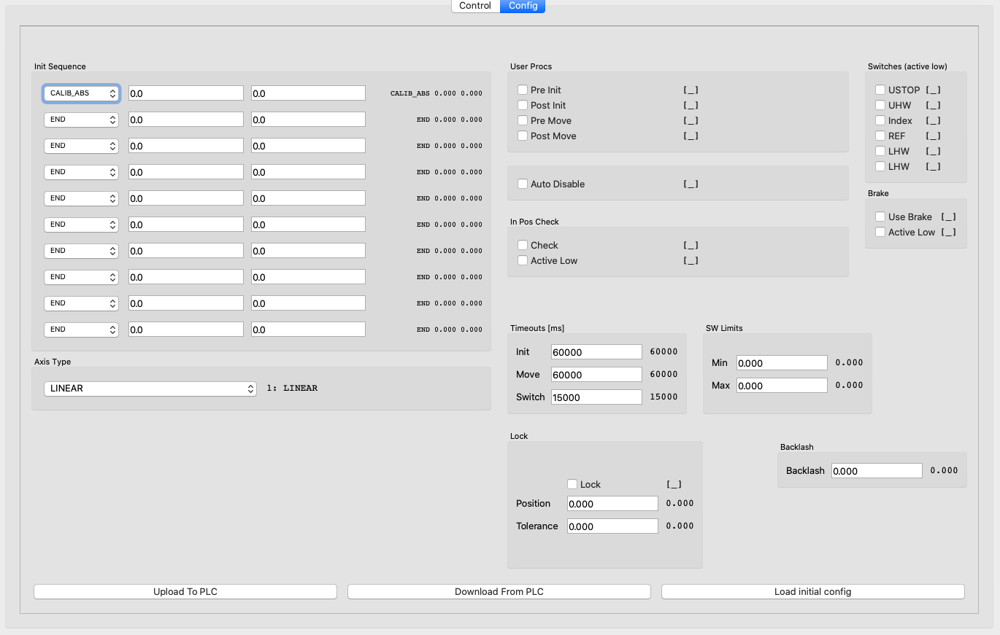
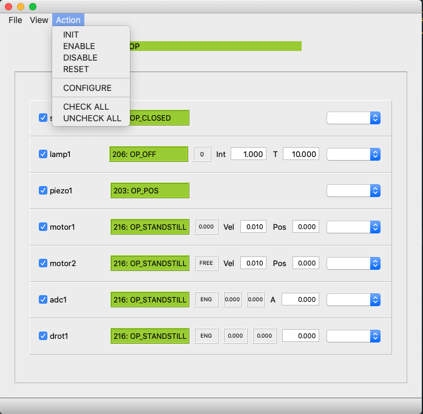
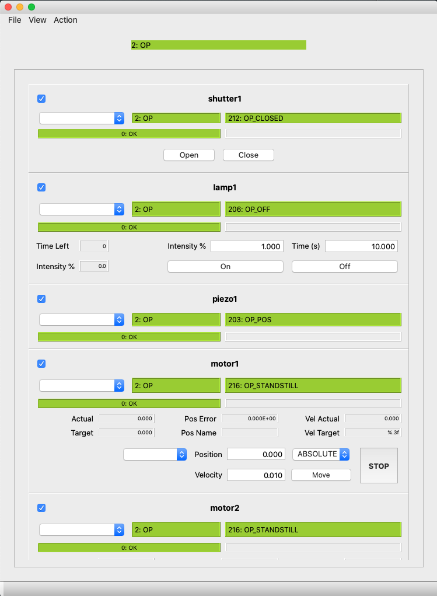

******
Manual
******

What is it ?
============

**pydevmgr_elt** package has two modules : 
    
- :mod:`pydevmgr_elt` detailed in this documentation. Tools dedicated for ELT low level framework devices communication. 
        So far Motor,  Drot, Adc, Shutter, Lamp are natively included with in addition the CcsSim and Time. 
- :mod:`pydevmgr_elt_qt` provides simple Widgets and guis for some ELT devices

.. note:: 
    
   **About versions**
   The official maintened version is now v0.6.x and above. 
    
   If you are a regular user of pydevmgr_elt to drive standard devices this new version is transparent. However some  
   changes has been done to build devices which are not backward compatible. 
   Also devices are following the v4 of the ESO low level software. So their is no garanty that v0.6 of pydevmgr_elt
   will work with version v3 of IFW low level softwre. 

   The core pluggin has been rewriten to follow the primary goal of providing a generic tool to drive any system.
           

If you do not know what is ELT software, this page is probably not for you.

In short **pydevmgr_elt** provides python objects to communicate directly to PLCs ELT devices via OPC-UA. 

**pydevmgr_elt** is a Python module to be used as substitute of a real device manager running in a ELT-Software environment.

**pydevmgr_elt** is not intended to be ran under a ELT software devenv but instead to replace it for some use cases during AIT, test and lab activities. 
Basically for intermediate hardware test for which it does not make sens to setup a full ELT instrument workstation. 
It does basically replace the ELT software device manager python client when it is not available. It was designed to be
used by non-software engineers in order to easily scrips sequences to integrate, tune and control hardwares. 

**pydevmgr_elt** was mainly developed with the following goal in mind :

- **Building AIT and integration scripts** when the ESO high level framework cannot be used or is not ready.
  Typicaly, for instance,  when one have a test bench with some motors ans wants to do some scripts in order to characterise the hardware. 
- **Build Engineering tools and small guis** which can be run from any computer and can be edited by non-software engineers during hardware integration or lab experiments.
- **Prototyping and testing of special devices**  writing down the basic skeleton of special devices at early development phase in a friendly python environment before being translated to a real ELT-Framework compatible special device. 
- **Use simple GUIs** to drive standard or custom ESO devices from any computers. For instance, useful when electronics and PLC setup is done separately in an other institute but wants to script some motor movements. 

**pydevmgr_elt** Does not really need `YAML`_ `configuration files`_  configuration file to run (all configuration can
be written in python). However `YAML`_ configuration files can be used but they are not anymore 100% compatible with ESO
framework configuration file in version IFW V4. Indead CII services to define yaml format does not work. However one can
simply remove the CII `YAML`_ markers and it should work (the rest of the config file is iddentical). 

.. warning:: 

   Configuration file has changed in V4 of IFW. They are not anymore 100% compatible with pydevmgr_elt v0.6 

A `tins`_, a test instrument, is included in the source package. It contains the yaml files and a running 
PLC project. The PLC project is not documented, see ESO FCS webpage for more information.  
The Example in the documents are given for the "tins" but are adaptable to any configurations. 

In the following doc Examples, it is assumed that the `tins`_ is running on a OPC-UA server. One can easily
adapt the Example from any working projects. Also it is assumed that the yaml files of the `tins`_ are accessible through
the ``$CFGPATH`` environment variable and they are edited to match the current hardware configuration (address,
namespace, etc).  

.. _tins: https://github.com/efisoft-elt/pydevmgr_elt/tree/main/tins

.. _pydevmgr_core: https://link-to-be-fixed
.. _pydevmgr_ua: https://link-to-be-fixed

Install
=======

Package
-------

With pip:

.. code-block:: bash

   > pip install pydevmgr_elt

To see the last version : https://pypi.org/project/pydevmgr_elt/#history

Or from the sources: 

.. code-block:: bash

   > git clone https://github.com/efisoft-elt/pydevmgr_elt.git 
   > cd pydevmgr_elt
   > python setup.py install 

If `pydevmgr_elt_qt` module is used, PyQt5 must be installed separately. This is done in purpose to make the install lighter. 

.. code-block:: bash

    > pip install pyqt5 
    
            

Basic Usage
===========

Vocabulary
----------

- ``Node`` 
   In **pydevmgr** a Node is an object dedicated for the get and set of one single data 
   located in a distant location (OPC-UA, A data base, a serial com ...). 
   In **pydevmgr_elt** :class:`pydevmgr_elt.EltNode` are dedicated for the communication through OPC-UA. 
- ``Rpc``  
   Remote Procedure Call object. In **pydevmgr_elt** :class:`pydevmgr_elt.EltRpc` is sending action request trhough
   OPC-UA
- ``Interface``  
   This is just a groupment of Nodes and/or Rpcs. Interface object can create nodes on-the-fly based on a default
   mapping or a custom map file.
   It hold a communication to the server and information to build Nodes. Most of the :class:`pydevmgr_elt.EltDevice`
   objects have three interfaces: ``stat``, ``cfg`` and ``rpcs`` which are grouping status nondes, config nodes and RPCs
   respectively. 
- ``Device`` 
   Device is the object representation of an hardware (or software) entity. It holds **Interfaces**, 
   eventually **nodes** and methods to send actions. It can have also other Device instances (e.g. :class:`pydevmgr_elt.Adc` has
   two :class:`pydevmgr_elt.Motor` devices as child). The Device is responsible to create the communictaiotn protocal and pass it
   to children Interface, Node, and Rpc. 
- ``Manager``  
    Is a collection of devices. See :class:`pydevmgr_elt.EltManager`, the devices can be inside different PLCs
    (different OPC-UA servers).   

Engine 
------

The `pydevmgr_core`_ documentation is still missing but in short: 

Each pydevmgr objects (see above) are made of a configuration and some runtime variables such as a ua-client object that goes
from device to interface to nodes during creation. 

The configuration dictate how the Object should behave. Instantiating two 
objects (with similar classes) with the same configuration shall result to exactly the same behavior.

Each object has a ``.new`` method. Its role is to build the object within the context of its parent. For instance, when 
creating an interface from a device the Ua communication client object is transferred from device to interface, 
similar when creating a node from the interface. Some other information as the OPC-UA node id is built at run time
thanks to parent and config informations.

After creating an object (Manager, Device, Interface, Node, Rpc) it is not guaranty that changing its configuration
instance will have the wanted effect. All configuration change must be done before creating the object. 

Configuration Files
-------------------

One can use yaml configuration file to configure device communication and control as it is done so 
far in IFW framework. The files are however not anymore compatible with IFW v4.

The configuration file shall be in one of the directories defined in the "$CFGPATH" environment variable.

For the ``tins`` this could be : 

.. code-block:: bash

    > export CFGPATH=${CFGPATH}:/__path/to/your/src__/pydevmgr/tins/resources

A script is available to generate configuration file ready for edition. The script is smart enough 
to build an almost ready to use device manager. 

Example of quick creation of device and manager config file in a shell :

.. code-block:: bash

    > pydevmgr_dump Motor > motor1.yml 
    > pydevmgr_dump Motor > motor2.yml 
    > pydevmgr_dump Manager > manager.yml 

``pydevmgr_dump`` (or ``pydevmgr_dump.exe`` on window computer) accept also some options.   

.. code-block:: bash

    > export CFGPATH=some/directory
    > mkdir $CFGPATH/fcs1
    > cd $CFGPATH/fcs1
    
    > pydevmgr_dump mapMotor > mapMotor.yml
    > pydevmgr_dump mapLamp > mapLamp.yml
    > pydevmgr_dump Motor motor1 --address opc.tcp://192.168.1.28:4840 --cfgdir "fcs1" > motor1.yml
    > pydevmgr_dump Motor motor2 --address opc.tcp://192.168.1.28:4840 --cfgdir "fcs1" > motor2.yml
    > pydevmgr_dump Lamp  lamp1  --address opc.tcp://192.168.1.28:4840 --cfgdir "fcs1" > lamp.yml
    > pydevmgr_dump Manager fcs1 --cfgdir "fcs1/server" > fcs1.yml 

Quick Start
+++++++++++

A device can be opened from a yaml configuration file or created directly in python. In the last 
case one must just edit the critical parameters, at least the ``address`` and ``prefix`` and use 
the proper device Class, so far they are:

- :class:`pydevmgr_elt.Motor` to drive FB_MOTOR, 
- :class:`pydevmgr_elt.Adc` to drive FB_MA_ADC
- :class:`pydevmgr_elt.Drot` to drive FB_MA_DROT
- :class:`pydevmgr_elt.Lamp` to drive FB_LAMP
- :class:`pydevmgr_elt.Shutter` to drive FB_SHUTTER
- :class:`pydevmgr_elt.Piezo` to drive FB_PIEZO
- :class:`pydevmgr_elt.Sensor` to drive FB_IODEV (to be updated) 
  

And 

- :class:`pydevmgr_elt.Time` for FB_TIME
- :class:`pydevmgr_elt.CcsSim` for FB_CCS_SIM

Each device class has its own ``.Config`` (a class) attribute  which basically
contains what a yaml configuration file (as defined by ESO) contains plus other stuff used by pydevmgr, 
those are  :class:`pydantic.BaseModel`.  Objects created from these class have an instance of  ``.Config`` 
with all the parameters eddited. 

.. code-block:: python

    from pydevmgr_elt import Motor 
    motor1 = Motor("motor1", address='opc.tcp://192.168.1.13:4840', prefix='MAIN.Motor1')

Above the keyword arguments are part of the configuration of the device. We can decompose the creation as follow  

.. code-block:: python

    from pydevmgr_elt import Motor 
    m1_config = Motor.Config(address='opc.tcp://192.168.1.13:4840', prefix='MAIN.Motor1')
    motor1 = Motor("motor1", config=m1_config) 

And then use it:

.. code-block:: python
   
    try:
       motor1.connect()
       print( "MOTOR1 POS", motor1.stat.pos_actual.get() )
    finally:
       motor1.disconnect()

From version v0.5 Devices and Manager also understand context management: entering a width statement is connecting and
exiting with is disconnecting the device or manager. The above example is equivalent to:

.. code-block:: Python
   
   from pydevmgr_elt import Motor 
   with Motor("motor1", address='opc.tcp://192.168.1.13:4840', prefix='MAIN.Motor1') as motor1:
        print( "MOTOR1 POS", motor1.stat.pos_actual.get() )
        # do more stuff 

To know the list of 'children'  available on a device (or any pydevmgr object)  one can use the ``.find`` method :  

.. code-block:: python

    from pydevmgr_elt import Motor, BaseInterface, BaseNode 

    motor1 = Motor("motor1", address='opc.tcp://192.168.1.13:4840', prefix='MAIN.Motor1')
    list(  motor1.find( BaseNode, -1 ) )                                                                                                                                                        
    
The :class:`pydevmgr_elt.EltDevice.Config` configuration structure is used by the :meth:`pydevmgr_elt.EltDevice.configure`
method which will send the proper configuration parameters to the PLC.   

If you are using a configuration file the simplest way is to use the :func:`open_elt_device` function. It will 
open a device with the right class according to the type defined inside the configuration file :

.. code-block:: python

   from pydevmgr_elt import open_elt_device
   motor1 = open_elt_device("tins/motor1.yml(motor1)")

The path to configuration file (here `tins/motor1.yml`) must be relative to one of the path defined in the ``$CFGPATH`` environment variable.
After the path file name comes the path to the object definition inside the yaml (here ``motor1``).    

An other use case, load a configuration and change some parameters:

.. code-block:: python
    
    from pydevmgr_elt import Motor
    conf = Motor.Config.from_cfgfile('tins/motor1.yml(motor1)')
    conf.address = "opc.tcp://192.167.34.5:4840"
    conf.initialisation[0].step = 'FIND_LHW'
    conf.initialisation[0].value1 = 3.0 
    conf.initialisation[0].value2 = 1.0 

   
    motor1 = Motor('motor1', config=conf)
    try:
       motor1.connect()
       motor1.configure() # send all configuration parameters to PLC 
    finally:
       motor1.disconnect()

ctrl_config configuration can be changed on a instance of a :class:`pydevmgr_elt.EltDevice` :

.. code-block:: python

   motor1.config.ctrl_config.tout_init = 60000
   motor1.config.ctrl_config.tout_move = 120000
   motor1.configure() # send (or re-send) the full configuration to PLC 

The last script will make what is in ``motor1.config.ctrl_config`` and what is configured in the PLC synchronized. However one can
directly change the value inside the PLC. Follows the two ways to do it : 

.. code-block:: python

   motor1.cfg.tout_init.set(60000)
   motor1.cfg.tout_move.set(120000)
   
Or can be done in one single OPC-UA call: 

.. code-block:: python
    
    from pydevmgr_elt import upload
    updload( {motor1.cfg.tout_init:60000,  motor1.cfg.tout_move:120000} )

    
One can also open directly a device manager configuration file including several devices, e.i. a ``Manager``: 

.. code-block:: python

    from pydevmgr_elt import open_elt_manager, wait
    tins = open_elt_manager("tins/tins.yml")
    try:
       tins.connect()   # Connect all devices associated to the manager
       tins.configure() # configure all tins devices down to PLC
       tins.reset() # reset all devices
       wait( tins.init() ) # init all devices and wait 
       wait( tins.enable() ) # enable all devices
       
       # etc ...
    finally:
        tins.disconnect()

Or, better amd mode compact, since v0.5: 

.. code-block:: python

    from pydevmgr_elt import open_elt_manager, wait
    with open_elt_manager("tins/tins.yml") as tins:
       tins.configure() # configure all tins devices down to PLC
       tins.reset() # reset all devices
       wait( tins.init() ) # init all devices and wait 
       wait( tins.enable() ) # enable all devices
       
       # etc ...

.. note::

    See tins.yml file https://github.com/efisoft-elt/pydevmgr_elt/blob/main/tins/resources/tins/tins.yml as Example. 

    
A manager (collection of several devices) can be also created without the need of a configuration file:

.. code-block:: python

    from pydevmgr_elt import EltManager, Motor
    
    devices = {
       'motor1' :   Motor("motor1", address='opc.tcp://192.168.1.13:4840', prefix='MAIN.Motor1'), 
       'motor2' :   Motor("motor2", address='opc.tcp://192.168.1.13:4840', prefix='MAIN.Motor2')
       }   
    
    mgr = EltManager('', devices=devices)
   
    assert mgr.motor1.prefix == "MAIN.Motor1"
    
    mgr.connect()
    
    >>> mgr.motor1.stat.pos_actual.get()
    4.0
    >>> download( m.stat.pos_actual for m in mgr.devices if m.config.type == 'Motor')
    [4.0, 3.4]
    
    
    
    

One important aspect of pydevmgr are Nodes (more bellow). Nodes in pydevmgr point to one 
single value (inside the PLC for the case of UaNode), they have the method :meth:`pydevmgr_elt.EltNode.get`, :func:`pydevmgr_elt.EltNode.set`
and the attribute `.key` which is a single identifier for the node in the context of the manager (e.i. python namespace). 

We will see that  :func:`pydevmgr_elt.EltNode.get`, `.set()` shall be rarely used, :func:`pydevmgr_core.download` and :func:`pydevmgr_core.upload` 
function shall be used instead because they allow to retrieve values in one call per server. 

Nodes are grouped usually in "interfaces" like the `.stat` attribute containing status variables (readonly nodes) 
and `.cfg` for every writable nodes concerning the configuration. 

    
Synchrone Execution & wait
--------------------------

pydevmgr is writen with regular function (not async function) but most of commands are asynchrone in 
the sens that PLC device does not need permanent connections to the OPC-UA to operate, it is always running. 
RPC methods return imediatly. 

Therefore one should be careful not to execute methods one after the other without checking if the 
states are correct to execute the next method(s). 

For instance :

.. code-block:: python
   
   # Do not Do That 
   >>> tins.adc1.init()
   >>> tins.adc1.enable()

**Will not work** because ``enable`` is called right after ``init``, before the hardware is finishing 
its initialisation.

Instead: 

.. code-block:: python
   
   # Do 
   >>> wait( tins.adc1.init() )
   >>> wait( tins.adc1.enable() )

What does return the ``init`` and ``enable`` is a Node to be checked to figure out if the requested action has been finished.  

E.g: In the exemple above ``init`` is returning the node ``tins.adc1.stat.initialised`` 

The :func:`pydevmgr_elt.wait` accept also a list of Node (or callable). By default 
it will wait that all input callables or node return ``True``. But the logic can be changed. 

.. code-block:: python

   from pydevmgr_elt import open_elt_manager, wait
   
   with open_elt_manager("tins/tins.yml") as mgr:   
       wait( [mgr.adc1.init(), mgr.drot1.init()] )
       wait( [mgr.adc1.enable(), mgr.dot1.enable()] )

  
   
   

All 'check' nodes are requested (in one call per server) at a configurable period (default is 0.1s, 10Hz).  

Wait has a timeout option. If time exceed timeout (in seconds) an exception is raised.

An other keyword of ``wait`` is ``lag`` which add x seconds before starting to check nodes values the first time. 
This can be useful to make sure that the requested action had time to start, for instance when moving motors: 

.. code-block:: python 
   
    wait( mgr.motor.move_abs(8,1.0) , lag=0.1 )

When the logic of the expecting "end of action" is not relevant, None is returned (and None is ignored by wait). 
One Example is the ``move_vel`` method of a motor, there is no end on this action. 

Note, on the Example above ``start_track()`` is returning a node ``is_tracking``.

The function :func:`wait` has a :class:`Waiter` counterpart where the node list definition is separated from the call:

.. code-block:: python
    
    from pydevmgr_core import Waiter
    waiter = Waiter([tins.motor1.stat.is_standstill, tins.motor2.stat.is_standstill], timeout=10)
    # somewhereless:
    waiter.wait()

Note, one can also use the :class:`AllTrue` node alias to combine node logic :

.. code-block:: python 

    from pydevmgr_core.nodes import AllTrue
    all_standstill = AllTrue(nodes=[tins.motor1.stat.is_standstill, tins.motor2.stat.is_standstill]) 
    wait( all_standstill )

A good practice would be also to add a node which check any errors and raise an exception in case of error, pydevmgr as
this (in v>0.4): 

.. code-block:: python

   
   wait (  [mgr.motor1.move_abs(4.5, 0.8), mgr.motor1.move_abs(4.5, 0.8),  mgr.motor1.stat.noerror_check,  mgr.motor2.stat.noerror_check ] )         

The noerror_check is a :class:`pydevmgr_core.NodeAlias` returning always True but raise an exception in case of device error 
(not RPC-Error, but the Function Block runtime error). This allow to interrupt the wait with an exception raised. 

.. _configuration files: http://www.eso.org/~eeltmgr/ICS/documents/IFW_HL/sphinx_doc/html/manuals/fcf/src/docs/devmgr.html#configuration
.. _YAML: https://yaml.org   

Application and Data 
====================

**pydevmgr_elt** provides several ways to retrieve data from OPC-UA node. One can use the ``.get`` method of a node but 
when several nodes has to be retrieve in the same time the function :func:`pydevmgr_elt.download` and the  :class:`pydevmgr_elt.Downloader`
allows to download nodes values in one call per server. 

One have the choice to work with structure for a cleaner definition of used data or with dictionaries to work more dynamically.
The idea behind this is to be able to program scripts without having to deal with device, nodes, etc at run time except when downloading 
data from PLC. Analysis function can just work with regular structure or dictionaries.   

Structure Base Model
--------------------

This is most probably the cleanest way to make an application or script with pydevmgr. The Data Structure is declared 
front end with all the necessary attributes to work with. Making a less ambiguous and more robust 
way to work with values at run time than a dynamic dictionary. It is also more IDE friendly. 

Data Structure are :class:`BaseModel` of the excellent `PYDANTIC`_ module (it is like an extension of data class with data validation). 

.. code-block:: python

    from pydevmgr_elt import NodeVar , DataLink, Motor
    from pydantic import BaseModel
    
    class SomeStatData(BaseModel):
        pos_actual: NodeVar[float] = 0.0
        pos_error:  NodeVar[float] = 0.0 
    
    motor1 = Motor( address="tpc.op://127.0.0.1:4841", prefix="MAIN.Motor1")    
    my_data =  SomeStatData()   
    dl = DataLink( motor1.stat, my_data)

Above, a call of ``dl.download()`` will trigger an update of ``my_data`` instance:

.. code-block:: python
   
   with motor1: 
      dl.download()
      my_data.pos_actual
   # 25.0

A full Data Model Class is available for each devices :

.. code-block:: python

    >>> mot_data = Motor.Data() # or  motor1.Data() in this exemple
    >>> dl = DataLink(mgr.motor1, mot_data)
    >>> dl.download()  
    >>> mot_data.stat
    MotorStatData(state=2, substate=216, error_code=0, is_operational=True, is_not_operational=False, is_ready=False, is_not_ready=False, is_in_error=False, substate_txt='OP_STANDSTILL', substate_group='OK', state_txt='OP', state_group='OK', error_txt='OK', pos_target=27.0, pos_actual=0.0, pos_error=0.0, vel_actual=0.0, scale_factor=0.0001, local=False, backlash_step=2, mode=0, initialised=True, init_step=0, init_action=0, axis_ready=True, axis_enable=True, axis_inposition=False, axis_lock=False, axis_brake=False, axis_info_data1=0, axis_info_data2=0, signal_lstop=False, signal_lhw=False, signal_ref=False, signal_index=False, signal_uhw=False, signal_ustop=False, is_moving=False, is_standstill=True, pos_name='')
    
Similary this should also work (note mgr.motor1 should be connected). 

.. code-block:: python   
 
    >>> mot_stat_data = Motor.Data.Stat() #  Motor.Stat.Data() gives the same results 
    >>> dl = DataLink(mgr.motor1.stat, mot_stat_data)
    >>> dl.download() 

Since version v0.6 a generic function create_data_class is available to dynamicaly create the class. 
Useful for a device manager for instance. 

.. code-block:: python
    
   from pydevmgr_core import create_data_class
   
   Data = create_data_class("MyData", mgr.find(BaseDevice) )
   data = Data()
   dl = DataLink( tins, data )
   
    
    
:class:`DataLink` understand a hierarchic data structure:

.. code-block:: python
    
    from pydevmgr_elt import EltManager, Motor, NodeVar
    from pydantic import BaseModel 

    class StatData(BaseModel):
         pos_actual: NodeVar[float] = 0.0
         pos_error:  NodeVar[float] = 0.0 
        
         
    class CfgData(BaseModel):
        backlash: NodeVar[float] = 0.0
        brake: NodeVar[bool] = False
    
    class MotData(BaseModel):
        stat: StatDada = StatData()
        cfg: CfgData = CfgData()
        name: str = ""
        
    class Data(BaseModel):
        motor1: MotData = MotData(name="motor1")
        motor2: MotData = MotData(name="motor2")

    mgr = EltManager(devices={
            "motor1": Motor("motor1", address="opc.tcp://127.0.0.1:4840", prefix="MAIN.Motor1"), 
            "motor2": Motor("motor2", address="opc.tcp://127.0.0.1:4840", prefix="MAIN.Motor2")
            })
    data = Data()
    dl =  DataLink(tins, data)
    
    try:
       mgr.connect()
       dl.download()
       print( data.motor1.stat.pos_actual , data.motor1.stat.pos_actual) 
    finally:
        mgr.disconnect()

The example above works because the path on the manager and on the data structure are iddentical. 
I mean `data.motor1.stat.pos_error`  <-> `mgr.motor1.stat.pos_error`   

However one can specify other path in the data structure thanks to attribute of the Pydantic `Field`, we can 
use the node attribute to determine the node path inside a tuple or string with "." separated names :

.. code-block:: python

    from pydantic import BaseModel, Field
    from pydevmgr_elt import NodeVar , DataLink, EltManager, Motor, NodeVar
    
    mgr = EltManager(devices={
            "motor1": Motor("motor1", address="opc.tcp://127.0.0.1:4840", prefix="MAIN.Motor1"), 
            "motor2": Motor("motor2", address="opc.tcp://127.0.0.1:4840", prefix="MAIN.Motor2")
            })

    class Data(BaseModel):
        m1_pos: NodeVar[float] = Field(0.0, node="motor1.stat.pos_actual")) 
        m2_pos: NodeVar[float] = Field(0.0, node="motor2.stat.pos_actual"))

    data = Data()
    dl = DataLink( mgr, data )
    
    try:
        mgr.connect()
        dl.download()
        print( data) 
    finally:
        mgr.disconnect()
        
.. _PYDANTIC: https://pydantic-docs.helpmanual.io

Dictionary based
----------------

For more dynamic applications. 

.. code-block:: python

    >>> data = {}
    >>> nodes = [tins.motor1.stat.pos_actual, tins.motor1.stat.pos_error, 
                 tins.motor1.stat.substate_txt,
                 tins.motor2.stat.pos_actual, tins.motor2.stat.pos_error, 
                 tins.motor2.stat.substate_txt]
    >>> download(nodes, data)
    >>> data
    {<UaNode key='motor1.pos_actual'>: 4.0,
     <UaNode key='motor1.pos_error'>: 0.0,
     <UaNode key='motor1.substate'>: 216,
     <UaNode key='motor2.pos_actual'>: 0.0,
     <UaNode key='motor2.pos_error'>: 0.0,
     <UaNode key='motor2.substate'>: 216,
     <NodeAlias key='motor2.substate_txt'>: 'OP_STANDSTILL',
     <NodeAlias key='motor1.substate_txt'>: 'OP_STANDSTILL'}

Note on the Example above ``substate_txt`` is a :class:`pydevmgr_core.NodeAlias` it transforms the substate number (from the PLC) into a text. 
In consequence, the substate node is downloaded from PLC and added as well in the data dictionary.  

Items of the data dictionary are node/value pairs. One can access  values with e.g. ``data[tins.motor1.stat.pos_actual]``. 
    
But a *view* of the data dictionary with string keys can be retrieved easily with ``DataView`` a wrapper around the
dictionary:

 .. code-block:: python
 
     >>> from pydevmgr_elt import DataView  
     >>> m1_data = DataView(data, tins.motor1.stat)
     >>> m1_data['pos_actual']
     30.0 
     >>> wait( tins.motor1.move_abs(25.0, 100))
     >>> download(nodes, data)
     >>> m1_data['pos_actual']
     25.0 

So a DataView can be used by a function for instance :

 .. code-block:: python
 
    def mot_info(pos_actual=0.0, pos_error=0.0, substate_txt=0, **extras):
         print(f"Substate is {substate_txt} and position is {pos_actual} with an error of {pos_error}")
    
    >>> mot_info(**m1_data)
    Substate is OP_STANDSTILL and position is 4.0 with an error of 0.0     
    >>> wait(tins.motor1.move_abs(30,100))
    >>> download(nodes, data)
    >>> mot_info(**m1_data)
    Substate is OP_STANDSTILL and position is 30.0 with an error of 0.0
 
a :class:`DataView` object is reflecting any change made in the root data except when a new node is added inside the root data dictionary. 
 
 
Each manager, device, interface objects has a find method used to return children 
One can also build the full list of nodes :

.. code-block:: python
   
   from pydevmgr_core import BaseNode
   
   data = {}     
   download( tins.find(BaseNode,-1), data )
   
In the example above find is looking for BaseNode object, the -1 argument is the depth, a negative depth is infinite. 

    

Nodes and Node Alias
====================

In addition to :class:`pydevmgr_elt.EltNode`, pydevmgr provide alias node :class:`pydevmgr_core.NodeAlias`. 
Their goal is to mimic a real server node by doing on-the-fly small computations.

When the alias node .get() method is called (or the node is added in a node list for download) the required 
nodes of the :class:`pydevmgr_core.NodeAlias` will also be downloaded from server

For instance `tins.motor1.stat.substate_txt` is 'getting' the text representation of the substate.
The substate integer is taken from server and converted into string on the fly. 
          
This allows to make the device capabilities uniform and more clear, the applications can than just 
focus on its tasks by using a single and simple data dictionary. The end user does not have to know 
if a node is real or an alias. 

For instance :

.. code-block:: python
    
    >>> download( [tins.motor1.stat.substate_txt, tins.motor2.stat.substate_txt] )
    ['OP_STANDSTILL', 'OP_STANDSTILL']

.. code-block:: python
        
    >>> data = {} 
    >>> download( [tins.motor1.stat.substate_txt, tins.motor2.stat.substate_txt], data )
    >>> data
     {
     <UaNode key='motor1.substate'>: 216,
     <UaNode key='motor2.substate'>: 216,
     <NodeAlias key='motor1.substate_txt'>: 'OP_STANDSTILL',
     <NodeAlias key='motor2.substate_txt'>: 'OP_STANDSTILL'
     }

An other good Example of node alias is the ``pos_name`` included in :class:`pydevmgr_elt.Motor.StatInterface` : 

.. code-block:: python
    
    >>> data = {} 
    >>> download( [mgr.motor1.stat.pos_name], data )
    >>> data
    {<UaNode key='motor1.pos_actual'>: 30.0, 
     <NodeAlias key='motor1.pos_name'>: 'ON'}

To generate a :class:`pydevmgr_core.NodeAlias` one can subclass the NodeAlias class and define the fget method:

.. code-block:: python

    from pydevmgr_core import NodeAlias 
    from typing import Tuple
    class IsCentered(NodeAlias): 
        class Config:
            center: Tuple[float,float] = (0.0, 0.0) 
            radius: float = 1.0
            
        def fget(self, pos1, pos2):
            r2 = (pos1-self.center[0])**2 + (pos2-self.center[1])**2 
            return r2 < self.radius**2 
    
    
    is_centered = IsCentered(nodes=[mgr.motor1.stat.pos_actual, mgr.motor2.stat.pos_actual], center=(0.5, 1.2), radius=2.0 )

    is_centered.get() 
    # True

The newly created class can by integrated in a device class for instance: 

.. code-block:: python
   
    from pydevmgr_elt import Motor 
    from pydevmgr_ua import UaDevice 
    class My2Axes(UaDevice):
        class Config:
            motor1 = Motor.Config(prefix="Motor1")
            motor2 = Motor.Config(prefix="Motor2")
            is_centered = IsCentered.Config(nodes=["motor1.stat.pos_actual", "motor2.stat.pos_actual"],  center=(0.5, 1.2), radius=2.0) 
    
    tiptilt = My2Axes( address="opc.tcp://192.168.1.11:4840", prefix="MAIN")
    with tiptilt: 
        print ( tiptilt.is_centered.get() )
    
                
However one can use the ``nodealias`` decorator to quickly create a node alias to an object. 
The nodealias decorator accept a list of string which define the path to the list of input nodes, the 
decorated method will get ``self`` the parent instance and the values returned by input nodes. For instance  

.. code-block:: python

   from pydevmgr_elt import nodealias, Motor

   class MyMotor(Motor):
      @nodealias("stat.pos_actual", "stat.pos_error")
      def is_at_home(self, pos, pos_error): 
          return abs(pos)<1.0 and  abs(pos_error)<0.3 
            

Or if this is not supposed to be configurable one can include the property directly inside the class  : 

.. code-block:: python

   class MyMotor(Motor):
        is_arrived = IsArrived.Config( node="stat.pos_error", sigma=0.05 )

Some useful alias node are built-in like : 

- :class:`pydevmgr_core.nodes.DequeList` which allow to fifo values of several nodes at each download. Useful for plot for instance.
- :class:`pydevmgr_core.nodes.DateTime`, :class:`pydevmgr_elt.nodes.UtcTime` to deal with time stamps
- :class:`pydevmgr_core.nodes.AllTrue`, :class:`pydevmgr_core.nodes.AnyTrue`, :class:`pydevmgr_core.nodes.AllFalse`, :class:`pydevmgr_core.nodes.AnyFalse` to combine 
  the logic of several nodes. 
- :class:`pydevmgr_core.nodes.InsideInterval` To check if a value is inside a given interval
- :class:`pydevmgr_core.nodes.PosName`  return names for given position

Building a Device handling OPC-UA  
=================================

:mod:`pydevmgr_elt` is built on :mod:`pydevmgr_ua` which provide basic base class to communicate with opc-ua. 

Bellow is defined a simplified version of a Motor device for read only purpose: 

.. code-block:: python 
    
    from pydevmgr_ua import UaDevice, UaNode, UaRpc
    from pydevmgr_core import nodealias, download  
    
    class Motor(UaDevice):
        pos = UaNode.Config( suffix="stat.lrPosActual") 
        state = UaNode.Config( suffix="stat.nState")
        substate = UaNode.Config( suffix="stat.nSubstate")
               
    class TipTilt(UaDevice): 
        class Config: 
            prefix = "MAIN"
            motor1 = Motor.Config( prefix="Motor1") 
            motor2 = Motor.Config( prefix="Motor2")
            
            temp_digit = UaNode.Config(suffix="a_path_to_a_node")
            
        @nodealias("temp_digit")
        def temp(self, digits): 
            return digits*100 
                
            
    with  TipTilt(address="opc.tcp://192.168.1.11:4840") as tiptilt:
        print( *download( [tiptilt.motor1.pos, tiptilt.motor2.pos]))
    

   For more complexe use case and special device one should read directly the code for a standard device in pydevmgr.
   The :class:`pydevmgr_elt.EltDevice` includes already common ``stat`` structure and some rpc method found in all
   devices (Init, Enable, Disable, Reset) and the :met:`pydevmgr_elt.EltDevice.configure`.
 
GUIS
====

.. note::

    `pydevmgr_qt_elt` is using PyQt5 which must be installed separately.  

The GUI part of **pydevmgr_elt** is constantly in progress. Making a full complete widget toolkit is time 
consuming and overkill for the purpose of this package. 
Instead tools will be added on demand. 

However one can quickly built a user interface for 
the purpose of **pydevmgr_elt**. 

.. warning:: For pydevmgr_elt_qt, pyqt5 and pyqtgraph shall be installed 

Device Widgets
--------------

Each devices have several widget kinds, serving different purposes: 

- ``'line'`` is one compact line for basic status monitoring and basic command 

   
- ``'ctrl'`` a complete interface to control and monitor devices

.. image:: img/motor_ctrl.png
   :width: 600

- ``'cfg'``  a widget interface to configure the device. So far only for motor in v0.6.

To create a device widget one can use the :func:`pydevmgr_core_qt.get_widget_factory` or directly the proper class 
to build it and than connect it to a device and a :class:`pydevmgr_core.Downloader`

.. code-block:: python 

    from pydevmgr_elt_qt import MotorCtrl
    from pydevmgr_elt import Motor, Downloader

    motor1 = Motor('motor1', address='opc.tcp://192.168.1.28:4840', prefix='MAIN.Motor1', namespace=4)
    downloader = Downloader()
    motor_ctrl = MotorCtrl() # create an empty widget 
    motor_ctrl.connect(downloader, motor1) # connect the widget to the downloader and the motor1 instance 
    
    with motor1:
        downloader.download() # This will update the widget with the new values it can be called in a timer 

The ``connect`` method above does : 

- add all the necessary nodes to the ``downloader``. i.e., The ones used by the widget
- add the widget :meth:`pydevmgr_elt_qt.MotorCtrl.update` method to the ``downloader`` call back queue: widget is updated after each download 
- update the widget (e.g. position names in drop-down menus, etc) and link buttons to device methods.  

The  :meth:`pydevmgr_elt_qt.MotorCtrl.disconnect` does the contrary, it free the nodes and callbacks from the ``downloader``
and remove buttons action, used when the widget is destroyed for instance.

Optionally the :meth:`pydevmgr_elt_qt.MotorCtrl.connect` returns a object used to enable and disable the widget
temporally : 

.. code-block:: python 
    
   
   c = motor_ctrl.connect(downloader, motor1)
   
   c.diable() # diable the widget and suspend the nodes download associated to this widget 
   c.enable() # reconnect the widget. 

Also one can have access to the data used by the widget in the ``c.data``  attribute. 

Here is a complete script to make a window GUI to control two motors : 

.. code-block:: python
    
    from pydevmgr_elt_qt import get_widget_factory
    from pydevmgr_elt import Motor, Downloader
    from PyQt5 import QtWidgets, QtCore
    from PyQt5.QtWidgets import QApplication, QMainWindow
    import sys
    
    
    
    def main_gui(motor1, motor2):
        downloader = Downloader()
        
        app = QApplication(sys.argv)
        win = QtWidgets.QWidget()
        layout =  QtWidgets.QVBoxLayout(win)
                
        motor1_wl = get_widget_factory("ctrl", motor1.config.type).build()
        motor1_wl.connect(downloader, motor1)
        layout.addWidget(motor1_wl.widget)
        
        motor2_wl = get_widget_factory("ctrl", motor2.config.type).build()
        motor2_wl.connect(downloader, motor2)
        layout.addWidget(motor2_wl.widget)
        
        win.show()
        timer = QtCore.QTimer()
        timer.timeout.connect(downloader.download)
        timer.start(100)
        
        sys.exit(app.exec_())        
        
    if __name__ == '__main__':
    
        motor1 = Motor('motor1', address='opc.tcp://192.168.1.11:4840', prefix='MAIN.Motor1')
        motor2 = Motor('motor2', address='opc.tcp://192.168.1.11:4840', prefix='MAIN.Motor2')
        
        with motor1, motor2:
            main_gui(motor1, motor2)

Motor GUI
---------

A gui for motor control and config is avaiable from a shell command 

.. code-block:: bash

   > pydevmgr_motor_gui tins/motor1.yml
    
   

Manager GUI
-----------

An automatic gui can be created easily with the `pydevmgr_gui` shell command :

.. code-block:: bash

   > pydevmgr_gui tins/tins.yml
   
A definition of the gui "views" or layouts can be done in a yml file (with suffix ``_ui.yml``) and a ui file. 
The yml define which device or type of device shall be included in layouts named in the ui file. For instance 
if the .ui file has a ``QVBoxLayout`` named ``ly_devices`` the manager suffixed ``_ui.yml`` file can declare what to add in this layout:

.. code-block:: yaml

    views:
        ctrl: # name of the "view"
            ui_file: simple_devices_frame.ui  # shall be in resources
            setup: # a list of rules defined inside a dictionary 
                - device: "*"   # all devices 
                  layout: ly_devices
                  widget_kind: "ctrl"
        
        motor1: 
            size: [1200,500]
            setup:
                - device: motor1              
                  widget_kind: "ctrl"
                - device: motor1              
                  widget_kind: "cfg"
              
  
For the `tins` this open a gui with several views. The view are defined  in the `tins_ui.yml <https://github.com/efisoft-elt/pydevmgr_elt/blob/main/tins/resources/tins/tins_ui.yml>`_ file. 

The best way to understand how the layout of the widget is done is to look at the screenshot bellow 
and have a look at `tins_extra.yml <https://github.com/efisoft-elt/pydevmgr_elt/blob/main/tins/resources/tins/tins_ui.yml>`_  file which I think is self explanatory. 

If no ``_ui.yml`` file was generated you will get a default gui which includes 2 views. One with all 'line' widget 
and the other one with 'ctrl' widgets 

Auto generated Indexes 
======================

.. automodule:: pydevmgr_elt
    :members:  GROUP,  Motor,  Drot, Adc, Shutter, Lamp, Piezo, Sensor, Time, CcsSim, EltManager, EltDevice 
               open_elt_manager, open_elt_device, nodealias, RpcError, EltRpc,  NodeAlias,  
               UaInt16, UaInt32, UaInt64, UaUInt16, UaUInt32, UaUInt64, UaFloat, UaDouble, 
               wait, Waiter,  
               Downloader, Uploader, DataView,
               download, upload, 
               open_elt_manager , 
               nodealias ,   kjoin , ksplit, 
               NodeVar , DataLink, 
               DataView , io 

.. automodule:: pydevmgr_core.nodes
    :members:  DateTime, UtcTime,
               AllTrue , AllFalse , AnyTrue , AnyFalse
               DequeList, Deque, 
               InsideInterval , PosName
