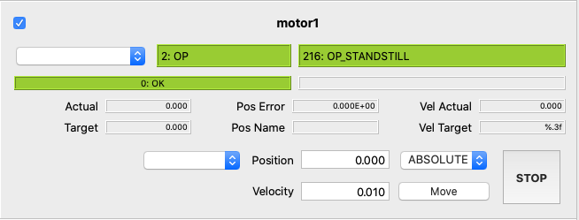

************
pydevmgr_elt
************

Current status : alpha version 0.2

What is it ?
============

**pydevmgr_elt** package has two modules : 
    
- :mod:`pydevmgr_elt` detailed in this documentation. Tools dedicated for ELT low level framework devices communication. 
        So far Motor,  Drot, Adc, Shutter, Lamp are natively included. 
- :mod:`pydevmgr_elt_qt` provides simple Widgets and guis for some ELT devices

.. note:: 
    
   **About v0.2 vs v0.3**
   The deprecated version 0.2 of this module was included in a pydevmgr package. Now, the package is independant and
   using two other subpackage `pydevmgr_core`_ core engine for pydevmgr and `pydevmgr_ua`_  
   
   In its current version 0.3, ``pydevmgr_elt`` is a separated module from ``pydevmgr_core`` and ``pydevmgr_ua``. 
   to communicate with the OPC-UA server. The core engine can now be used for other purposes then communicating with 
   ELT devices or OPC-UA (e.g. serial com, custom websockets, etc ...)
   
   Compare to v0.2 Some base classes as been renamed, e.g.  UaDevice -> EltDevice.  UaDevice is now part of `pydevmgr_ua`_. 
   For the end user who just want to move motors the change in version 0.3 should not realy matters with two exceptions:

    - :func:`pydevmgr_elt.open_elt_device` is replacing `open_device`
    - :func:`pydevmgr_elt.open_elt_manager` is replacing the `open_manager`
   
        

If you do not know what is ELT software, this page is probably not for you.

In short **pydevmgr_elt** provides auto-built python objects to communicate to PLCs ELT devices via OPC-UA. 

**pydevmgr_elt** is a Python module to be used as substitute of a real device manager running in a ELT-Software environment.
The module is somehow in between a simple python opc-ua script client and a real integrated device manager.

**pydevmgr_elt** is not intended to be ran under a ELT software devenv but instead to replace it for some use cases during ait test and lab activities. 
Basically for intermediate hardware test for which it does not make sens to setup a full ELT instrument workstation. 
It does basically replace the ELT software device manager python client when it is not available. It was designed to be
used by non-software engineers in order to easily scrips sequences to integrate,tune and control hardwares. 

**pydevmgr_elt** was mainly developed with the following goal in mind :

- **Building AIT and integration scripts** when the ESO high level framework cannot be used or is not ready. For
  instance, making sequence of movement of a motor with a lab serial temperatur sensor plugged on a computer.
- **Build Engineering tools and small guis** which can be run from any computer and can be edited by non-software engineers.
- **Prototyping of special devices**  writing down the basic skeleton of special devices in a friendly python environment before being translated to a real ELT-Framework compatible special device. 
- **Use simple GUIs** to drive standard or custom ESO devices from any computers. For instance, useful when electronics and PLC setup is done separately in an other institute but wants to script some motor movements. 

**pydevmgr_elt** can use the `YAML`_ `configuration files`_ as defined by ESO (in ELT software version 2&3) to communicate with the PLC through OPC-UA. 
This allows to reuse those configuration files directly in the ESO fcf software. 

Note that in future update of the ELT CII this configuration files will no longer be valid but it  
should not be a problem as long as low level software is unchanged, pydevmgr_elt will still work, 
only the ability to copy past configuration files will be lost.  

A `tins`_, a test instrument, is included in the source package. It contains the yaml files and a running 
PLC project. The PLC project is not documented, see ESO FCS webpage for more information.  
The Example in the documents are given for the "tins" but are adaptable to any configurations. 

In the following doc Examples it is assumed that the `tins`_ is running on a OPC-UA server. One can easily
adapt the Example from any working projects. Also it is assumed that the yml files of the `tins`_ are accessible through
the ``$CFGPATH`` environment variable and they are edited to match the current hardware configuration (address,
namespace, etc).  

.. _tins: https://github.com/efisoft-elt/pydevmgr_elt/tree/main/tins

.. _pydevmgr_core: https://link-to-be-fixed
.. _pydevmgr_ua: https://link-to-be-fixed

Install
=======

Package
-------

With pip:

.. code-block:: bash

   > pip install pydevmgr_elt

.. warning:: 

   Before 0.3 this was  pydevmgr has to be installed instead of pydevmgr_elt 

To see the last version : https://pypi.org/project/pydevmgr_elt/#history

Or from the sources: 

.. code-block:: bash

   > git clone https://github.com/efisoft-elt/pydevmgr_elt.git 
   > cd pydevmgr_elt
   > python setup.py install 

If `pydevmgr_elt_qt` module is used, PyQt5 must be installed separately. This is done in purpose to make the install lighter. 

.. warning:: 

   In 0.2 this module was named pydevmgr_qt instead of pydevmgr_elt_qt

.. code-block:: bash

    > pip install pyqt5 
    
            
Configuration Files
-------------------

One can use yaml configuration file to configure device communication and control as it is done so 
far in v3 framework. But as we will see below this is not necessary. 

The configuration file shall be in one of the directories defined in the "$CFGPATH" environment variable.

For the ``tins`` this could be : 

.. code-block:: bash

    > export CFGPATH=${CFGPATH}:/__path/to/your/src__/pydevmgr/tins/resources

A script is available to generate configuration file ready for edition. The script is smart enough 
to build an almost ready to use device manager. 

Example of quick creation of device and manager config file in a shell :

.. code-block:: bash

    > pydevmgr_dump Motor > motor1.yml 
    > pydevmgr_dump Motor > motor2.yml 
    > pydevmgr_dump Manager > manager.yml 

``pydevmgr_dump`` (or ``pydevmgr_dump.exe`` on window computer) accept also some options.   

.. code-block:: bash

    > export CFGPATH=some/directory
    > mkdir $CFGPATH/fcs1
    > cd $CFGPATH/fcs1
    
    > pydevmgr_dump mapMotor > mapMotor.yml
    > pydevmgr_dump mapLamp > mapLamp.yml
    > pydevmgr_dump Motor motor1 --address opc.tcp://192.168.1.28:4840 --cfgdir "fcs1" > motor1.yml
    > pydevmgr_dump Motor motor2 --address opc.tcp://192.168.1.28:4840 --cfgdir "fcs1" > motor2.yml
    > pydevmgr_dump Lamp  lamp1  --address opc.tcp://192.168.1.28:4840 --cfgdir "fcs1" > lamp.yml
    > pydevmgr_dump Manager fcs1 --cfgdir "fcs1/server" > fcs1.yml 

Basic Usage
===========

Vocabulary
----------

- ``Node`` 
   In **pydevmgr** a Node is an object dedicated for the get and set of one single data 
   located in a distant location (OPC-UA, A data base, a serial com ...). 
   In **pydevmgr_elt** :class:`pydevmgr_elt.EltNode` are dedicated for the communication through OPC-UA. 
- ``Rpc``  
   Remote Procedure Call object. In **pydevmgr_elt** :class:`pydevmgr_elt.EltRpc`
- ``Interface``  
   This is just a groupment of Nodes or Rpcs. Interface object can create nodes on-the-fly based on the map file.
   It hold a communication to the server and information to build Nodes. In **pydevmgr_elt** :class:`pydevmgr_elt.EltInterface`
   is dedicated for grouping :class:`pydevmgr_elt.EltNode` by they  kind. e.g. ``stat`` nodes, ``cfg`` nodes etc ... 
   :class:`pydevmgr_elt.EltRpcInterface` is the interface for :class:`pydevmgr_elt.EltRpc`. :class:`pydevmgr_elt.EltInterface`
   and :class:`pydevmgr_elt.EltRpcInterface` uses a map dictionary of python attribute name/ OPC-UA suffix pairs 
   to build nodes or rpcs. It has also an OPC-UA prefix and a client to communicate to OPC-UA.
- ``Device`` 
   Device is the object representation of an hardware (or software) entity. It holds **Interfaces**, 
   eventually **nodes** and methods to send actions. It cat have also other Device instance (e.g. :class:`pydevmgr_elt.Adc` has
   two :class:`pydevmgr_elt.Motor` devices)
- ``Manager``  
    Is a collection of devices. It can have also nodes, rpc and interfaces. See :class:`pydevmgr_elt.EltManager`   

Quick Start
+++++++++++

A device can be opened from a yaml configuration file or created directly in python. In the last 
case one must just edit the critical parameters, at least the ``address`` and ``prefix`` and use 
the proper device Class, so far they are:

- :class:`pydevmgr_elt.Motor` to drive FB_MOTOR, 
- :class:`pydevmgr_elt.Adc` to drive FB_MA_ADC
- :class:`pydevmgr_elt.Drot` to drive FB_MA_DROT
- :class:`pydevmgr_elt.Lamp` to drive FB_LAMP
- :class:`pydevmgr_elt.Shutter` to drive FB_SHUTTER
- :class:`pydevmgr_elt.Piezo` to drive FB_PIEZO

And 

- :class:`pydevmgr_elt.Time` for FB_TIME
- :class:`pydevmgr_elt.CcsSim` for FB_CCS_SIM

Each device class has its own ``.Config`` attribute  which basically contains what a yaml configuration 
file (as defined by ESO) contains, this is  :class:`pydantic.BaseModel`.

.. code-block:: python

    from pydevmgr_elt import Motor 
    m1_config = Motor.Config(address='opc.tcp://192.168.1.13:4840', prefix='MAIN.Motor1')
    motor1 = Motor("motor1", config=m1_config) 
    
    try:
       motor1.connect()
       print( "MOTOR1 POS", motor1.stat.pos_actual.get() )
    finally:
       motor1.disconnect()

As a short-cut one can also use keyword parameters of the :class:`pydevmgr_elt.UaDevice` declaration (here is a :class:`pydevmgr_elt.Motor`) to define the configuration:

.. code-block:: python

    from pydevmgr_elt import Motor 
    motor1 = Motor("motor1", address='opc.tcp://192.168.1.13:4840', prefix='MAIN.Motor1')

    
If no ``mapfile`` is given a default mapping is loaded. Two look at the list of accessible nodes for instance : 

.. code-block:: python

    >>> list(  motor1.nodes )                                                                                                                                                                   
    
The :class:`pydevmgr_elt.EltDevice.Config` configuration structure is used by the :meth:`pydevmgr_elt.EltDevice.configure`
method which will send the proper configuration parameters to the PLC.   

If you are using a configuration file the simplest way is to use the :func:`open_elt_device` function. It will 
open a device with the right class according to the type defined inside the configuration file :

.. warning:: 

    Before v0.3 :func:`open_elt_device` was open_device 

.. code-block:: python

   from pydevmgr_elt import open_elt_device
   motor1 = open_elt_device("tins/motor1.yml")

The path to configuration file (here `tins/motor1.yml`) must be relative to one of the path defined in the $CFGPATH environment variable.   

An other use case, load a configuration and change some parameters:

.. code-block:: python
    
    from pydevmgr_elt import Motor
    conf = Motor.Config.from_cfgfile('tins/motor1.yml', path="motor1")
    conf.initialisation.sequence = ['FIND_LHW']
    conf.initialisation.FIND_LHW.value1 = 3.0                                                    
    conf.initialisation.FIND_LHW.value2 = 1.0 
    
    motor1 = Motor('motor1', conf)
    try:
       motor1.connect()
       motor1.configure() # send all configuration parameters to PLC 
    finally:
       motor1.disconnect()

Also configuration can be changed on a instance of a :class:`pydevmgr_elt.EltDevice` :

.. code-block:: python

   motor1.config.ctrl_config.tout_init = 60000
   motor1.config.ctrl_config.tout_move = 120000
   motor1.configure() # send (or re-send) the full configuration to PLC 

The last script will make what is in ``motor1.config`` and what is configured in the PLC synchronized. However one can
directly change the value inside the PLC. Follows the two ways to do it : 

.. code-block:: python

   motor1.cfg.tout_init.set(60000)
   motor1.cfg.tout_move.set(120000)
   
Or can be done in one single OPC-UA call: 

.. code-block:: python
    
    from pydevmgr_elt import upload
    updload( {motor1.cfg.tout_init:60000,  motor1.cfg.tout_move:120000} )

    
One can also open directly a device manager configuration file including several devices, e.i. a ``Manager``: 

.. code-block:: python

    from pydevmgr_elt import open_elt_manager, wait
    tins = open_elt_manager("tins/tins.yml")
    try:
       tins.connect()   # Connect all devices associated to the manager
       tins.configure() # configure all tins devices down to PLC
       tins.reset() # reset all devices
       wait( tins.init() ) # init all devices and wait 
       wait( tins.enable() ) # enable all devices
       
       # etc ...
    finally:
        tins.disconnect()
    

.. note::

    See tins.yml file https://github.com/efisoft-elt/pydevmgr_elt/blob/main/tins/resources/tins/tins.yml as Example. 

    
A manager (collection of several devices) can be also created without the need of a configuration file:

.. code-block:: python

    from pydevmgr_elt import UaManager, Motor
    
    devices = {
       'motor1' :   Motor("motor1", Motor.Config(address='opc.tcp://192.168.1.13:4840', prefix='MAIN.Motor1')), 
       'motor2' :   Motor("motor2", Motor.Config(address='opc.tcp://192.168.1.13:4840', prefix='MAIN.Motor2'))
       }   
    
    mgr = EltManager('', devices=devices)
    
    mgr.connect()
    
    >>> mgr.motor1.stat.pos_actual.get()
    4.0
    >>> download( m.stat.pos_actual for m in mgr.devices if m.dev_type == 'Motor')
    [4.0, 3.4]
    
    
    
    

One important aspect of pydevmgr are Nodes (more bellow). Nodes in pydevmgr point to one 
single value (inside the PLC for the case of UaNode), they have the method :meth:`pydevmgr_elt.EltNode.get`, :func:`pydevmgr_elt.EltNode.set`
and the attribute `.key` which is a single identifier for the node in the context of the manager (e.i. python namespace). 
We will see that  :func:`pydevmgr_elt.EltNode.get`, `.set()` shall be rarely used, :func:`pydevmgr_core.download` and :func:`pydevmgr_core.upload` 
function shall be used instead because they allow to retrieve values in one call per server. 

Nodes are grouped usually in "interfaces" like the `.stat` attribute containing status variables (readonly nodes) 
and `.cfg` for every writable nodes concerning the configuration. 

    
Synchrone Execution & wait
--------------------------

pydevmgr is writen with regular function (not async function) but most of commands are asynchrone in 
the sens that PLC device does not need permanent connections to the OPC-UA to operate, it is always running. 
RPC methods return imediatly. 

Therefore one should be careful not to execute methods one after the other without checking if the 
states are correct to execute the next method(s). 

For instance :

.. code-block:: python

   >>> tins.adc1.init()
   >>> tins.adc1.enable()

**Will not work** because ``enable`` is called right after ``init``, before the hardware is finishing 
its initialisation.

The :func:`pydevmgr_core.wait` function is used to wait for some condition to be true, in the case above we should 
wait that the device is initialised :  

.. code-block:: python

   from pydevmgr_elt import open_elt_manager, wait
   mgr = open_elt_manager("tins/tins.yml")
   
   mgr.connect()
   mgr.configure() # configure all devices
   
   mgr.adc1.init()
   mgr.drot1.init()
   
   wait([mgr.adc1.stat.initialised, mgr.drot1.stat.initialised])
   
   mgr.adc1.enable()
   mgr.drot1.enable()
   

:func:`pydevmgr_elt.wait` accept a list of Nodes (node values are fetch from server) or callable, by default 
it will wait that all callables or node return ``True``. But the logic can be changed. All nodes are requested 
(in one call per server) at a configurable period (default is 0.1s).  

One can mix regular function and boolean node, but if a function needs other nodes it is preferable to
use a :class:`pydevmgr_core.NodeAlias` (more on this bellow): 

.. code-block:: python

    >>> inpos = lambda : abs(tins.adc1.motor1.stat.pos_actual.get()-4.34)<0.01
    >>> wait( [inpos], timeout=60 )

Shall be written instead :

.. code-block:: python
    
    inpos = nodealias1( node=tins.adc1.motor1.stat.pos_actual)(lambda pos: abs(pos-4.34)<0.01)
    >>> wait( [inpos], timeout=60 )

The nodea lias can be also created using decorator

.. code-block:: python
    
    @nodealias(nodes=[tins.adc1.motor1.stat.pos_actual])
    def inpos(pos):
        return abs(pos - 4.34)<0.01

An other exemple in 2d :

.. code-block:: python
    
    @nodealias(nodes=[tins.adc1.motor1.stat.pos_actual, tins.adc1.motor2.stat.pos_actual)
    def is_centered(pos_x, poz_y):
        return (pos_x-4.34)**2 + (pos_y-0.56)**2 < 0.01*2

Wait has a timeout option. If time exceed timeout (in seconds) an exception is raised.

An other keyword of ``wait`` is ``lag`` which add x seconds before starting to check nodes values.  

A nice feature of pydevmgr: action methods of devices are returning a valid object 
(node, nodealias, None or a function) for the wait function. 
For instance:

- ``mgr.motor1.move_ads(5.1,1.0)`` is returning a  ``is_standstill`` node to check if the motor finished is movement. 
- ``init()`` method will return a ``is_ready`` node.
- ``init()`` of a manager will return a node to check if all device init has been done.
- etc ...

So following the Example above one can do : 

.. code-block:: python

    from pydevmgr_elt import open_elt_manager, wait
    tins = open_elt_manager("tins/tins.yml")
    
    try:
        tins.connect()
        tins.configure()
        
        wait( tins.reset() ) # reset all devices 
        wait( tins.init() )  # init all devices       
        wait( [tins.adc1.enable(), tins.drot1.enable()] )  #enable only adc1 and drot1
        wait( [tins.adc1.start_track(), tins.drot1.start_track('SKY')], lag=0.5) # start adc1 and drot1 tracking 
    finally:
        tins.disconnect_all()

When the logic of the expecting "end of action" is too embigous, None is returned (None is ignored by wait). 
One Example is the ``move_vel`` method of a motor there is no end on this action. 

On the Example above ``start_track()`` is returning a node ``is_tracking``.

The function :func:`wait` has a :class:`Waiter` counterpart where the node list definition is separated from the call:

.. code-block:: python

    >>> waiter = Waiter([tins.motor1.stat.is_standstill, tins.motor2.stat.is_standstill], timeout=10)
    # somewhereless:
    >>> waiter.wait()

Note, one can also use the :class:`AllTrue` node alias to combine node logic :

.. code-block:: python 

    >>> from pydevmgr_elt import AllTrue
    >>> all_standstill = AllTrue(nodes=[tins.motor1.stat.is_standstill, tins.motor2.stat.is_standstill]) 
    >>> wait( [all_standstill] )
    

.. _configuration files: http://www.eso.org/~eeltmgr/ICS/documents/IFW_HL/sphinx_doc/html/manuals/fcf/src/docs/devmgr.html#configuration
.. _YAML: https://yaml.org   

Application and Data 
====================

**pydevmgr_elt** provides several ways to retrieve data from OPC-UA node. One can use the ``.get`` method of a node but 
when several nodes has to be retrieve in the same time the function :func:`pydevmgr_elt.downloader` and the  :class:`pydevmgr_elt.Downloader`
allows to download nodes values in one call per server. 

One have the choice to work with structure for a cleaner definition of used data or with dictionaries to work more dynamically.
The idea behind this is to be able to program scripts without having to deal with device, nodes, etc at run time except when downloading 
data from PLC. Analysis function can just work with regular structure or dictionaries.   

Dictionary based
----------------

.. code-block:: python

    >>> data = {}
    >>> nodes = [tins.motor1.stat.pos_actual, tins.motor1.stat.pos_error, 
                 tins.motor1.stat.substate_txt,
                 tins.motor2.stat.pos_actual, tins.motor2.stat.pos_error, 
                 tins.motor2.stat.substate_txt]
    >>> download(nodes, data)
    >>> data
    {<UaNode key='motor1.pos_actual'>: 4.0,
     <UaNode key='motor1.pos_error'>: 0.0,
     <UaNode key='motor1.substate'>: 216,
     <UaNode key='motor2.pos_actual'>: 0.0,
     <UaNode key='motor2.pos_error'>: 0.0,
     <UaNode key='motor2.substate'>: 216,
     <NodeAlias key='motor2.substate_txt'>: 'OP_STANDSTILL',
     <NodeAlias key='motor1.substate_txt'>: 'OP_STANDSTILL'}

Note on the Example above ``substate_txt`` is a :class:`pydevmgr_core.NodeAlias` it transforms the in substate (from the PLC) into a text. 
In consequence the substate node is downloaded from PLC and added as well in the data dictionary.  

Items of the data dictionary are node/value pairs. One can access  values with e.g. ``data[tins.motor1.stat.pos_actual]``. 
    
But a *view* of the data dictionary with string keys can be retrieved easely :

 .. code-block:: python
 
     >>> from pydevmgr_elt import DataView  
     >>> m1_data = DataView(data, tins.motor1)
     >>> m1_data['pos_actual']
     30.0 
     >>> wait( tins.motor1.move_abs(25.0, 100))
     >>> download(nodes, data)
     >>> m1_data['pos_actual']
     25.0 

So a DataView can be used by a function for instance :

 .. code-block:: python
 
    def mot_info(pos_actual=0.0, pos_error=0.0, substate_txt=0, **extras):
         print(f"Substate is {substate_txt} and position is {pos_actual} with an error of {pos_error}")
    
    >>> mot_info(**m1_data)
    Substate is OP_STANDSTILL and position is 4.0 with an error of 0.0     
    >>> wait(tins.motor1.move_abs(30,100))
    >>> download(nodes, data)
    >>> mot_info(**m1_data)
    Substate is OP_STANDSTILL and position is 30.0 with an error of 0.0
 
a :class:`DataView` object is reflecting any change made in the root data except when a new node is added inside the root data dictionary. 
 
 
Each ``.cfg`` and ``.stat`` interface have a ``.nodes`` property returning all the nodes in a list

One can also build the full list of native nodes :

.. code-block:: python

   >>> data = {}
   >>> all_nodes = sum( ( list(d.stat.nodes) for d in tins.devices), [])
   >>> download( all_nodes, data)
   >>> len(data)
   255
  
At home, connected to a slow window computer running TwinCat on the home box wifi it takes ~30ms to download 
the 255 node values. Which is more than enough to build smooth 10Hz refreshed Guis for instance.

 
Structure Base Model
--------------------

This is most probably the cleanest way to make an application or script with pydevmgr. The Data Structure is declared 
frontend with all the necessary attributes to work with. Making a less ambiguous and more robust 
way to work  with values at run time than a dynamic dictionary. 

Data Structure are :class:`BaseModel` of the excellent `PYDANTIC`_ module (it is like an extention of data class with data validation). 

.. code-block:: python

    from pydevmgr_elt import NodeVar , DataLink, Motor
    from pydantic import BaseModel
    
    class SomeStatData(BaseModel):
        pos_actual: NodeVar[float] = 0.0
        pos_error:  NodeVar[float] = 0.0 
    
    motor1 = Motor( address="tpc.op://127.0.0.1:4841", prefix="MAIN.Motor1")    
    my_data =  SomeStatData()   
    dl = DataLink( motor1.stat, my_data)
    
Above, a call of ``dl.download()`` will trigger an update of ``my_data`` instance:

.. code-block:: python

   >>> dl.download()
   >>> my_data.pos_actual
   25.0

A full Data Model Class is available for each devices :

.. code-block:: python

    >>> mot_data = Motor.Data() # or  motor1.Data() in this exemple
    >>> dl = DataLink(mgr.motor1, mot_data)
    >>> dl.download()  
    >>> mot_data.stat
    MotorStatData(state=2, substate=216, error_code=0, is_operational=True, is_not_operational=False, is_ready=False, is_not_ready=False, is_in_error=False, substate_txt='OP_STANDSTILL', substate_group='OK', state_txt='OP', state_group='OK', error_txt='OK', pos_target=27.0, pos_actual=0.0, pos_error=0.0, vel_actual=0.0, scale_factor=0.0001, local=False, backlash_step=2, mode=0, initialised=True, init_step=0, init_action=0, axis_ready=True, axis_enable=True, axis_inposition=False, axis_lock=False, axis_brake=False, axis_info_data1=0, axis_info_data2=0, signal_lstop=False, signal_lhw=False, signal_ref=False, signal_index=False, signal_uhw=False, signal_ustop=False, is_moving=False, is_standstill=True, pos_name='')
    
Similary this should also work 

.. code-block:: python   
 
    >>> mot_stat_data = Motor.Data.StatData() #  Motor.StatInterface.Data() gives the same results 
    >>> dl = DataLink(mgr.motor1.stat, mot_stat_data)
    >>> dl.download()  
    
    
:class:`DataLink` understand a hierarchic data structure:

.. code-block:: python
    
    from pydevmgr_elt import EltManager, Motor, NodeVar
    from pydantic import BaseModel 

    class StatData(BaseModel):
         pos_actual: NodeVar[float] = 0.0
         pos_error:  NodeVar[float] = 0.0 
        
         
    class CfgData(BaseModel):
        backlash: NodeVar[float] = 0.0
        brake: NodeVar[bool] = False
    
    class MotData(BaseModel):
        stat: StatData = StatData()
        cfg: CfgData = CfgData()
        name: str = ""
        
    class Data(BaseModel):
        motor1: MotData = MotData(name="motor1")
        motor2: MotData = MotData(name="motor2")

    mgr = EltManager(devices={
            "motor1": Motor("motor1", address="opc.tcp://127.0.0.1:4840", prefix="MAIN.Motor1"), 
            "motor2": Motor("motor2", address="opc.tcp://127.0.0.1:4840", prefix="MAIN.Motor2")
            })
    data = Data()
    dl =  DataLink(tins, data)
    
    try:
       mgr.connect()
       dl.download()
       print( data.motor1.stat.pos_actual , data.motor1.stat.pos_actual) 
    finally:
        mgr.disconnect()

The example above works because the path on the manager and on the data structure are the same. 
I mean `data.motor1.stat.pos_error`  <-> `mgr.motor1.stat.pos_error`   

However one can specify other path in the data structure thanks to attribute of the Pydantic `Field`, we can 
use the node attribute to determine the node path inside a tuple :

.. code-block:: python

    from pydantic import BaseModel, Field
    from pydevmgr_elt import NodeVar , DataLink, EltManager, Motor, NodeVar
    
    mgr = EltManager(devices={
            "motor1": Motor("motor1", address="opc.tcp://127.0.0.1:4840", prefix="MAIN.Motor1"), 
            "motor2": Motor("motor2", address="opc.tcp://127.0.0.1:4840", prefix="MAIN.Motor2")
            })

    class Data(BaseModel):
        m1_pos: NodeVar[float] = Field(0.0, node=("motor1", "stat", "pos_actual")) 
        m2_pos: NodeVar[float] = Field(0.0, node=("motor2", "stat", "pos_actual"))

    data = Data()
    dl = DataLink( mgr, data )
    
    try:
        mgr.connect()
        dl.download()
        print( data) 
    finally:
        mgr.disconnect()
        
.. _PYDANTIC: https://pydantic-docs.helpmanual.io

Nodes and Node Alias
====================

In addition to :class:`pydevmgr_elt.EltNode`, pydevmgr provide alias node :class:`pydevmgr_core.NodeAlias`. 
Their goal is to mimic a real server node by doing on-the-fly small computations.

When the alias node .get() method is called (or the node is added in a node list for download) the required 
nodes of the :class:`pydevmgr_core.NodeAlias` will also be downloaded from server

For instance `tins.motor1.stat.substate_txt` is 'geting' the text representation of the substate.
The substate integer is taken from server and converted into string on the fly. 
          
This allows to make the device capabilities uniforme and more clear, the applications can than just 
focus on its tasks by using a single and simple data dictionary. The en user does not have to know 
is a node is real or an alias. 

For instance :

.. code-block:: python
    
    >>> download( [tins.motor1.stat.substate_txt, tins.motor2.stat.substate_txt] )
    ['OP_STANDSTILL', 'OP_STANDSTILL']

.. code-block:: python
        
    >>> data = {} 
    >>> download( [tins.motor1.stat.substate_txt, tins.motor2.stat.substate_txt], data )
    >>> data
     {
     <UaNode key='motor1.substate'>: 216,
     <UaNode key='motor2.substate'>: 216,
     <NodeAlias key='motor1.substate_txt'>: 'OP_STANDSTILL',
     <NodeAlias key='motor2.substate_txt'>: 'OP_STANDSTILL'
     }

An other good Example of node alias is the ``pos_name`` included in :class:`pydevmgr_elt.Motor.StatInterface` : 

.. code-block:: python
    
    >>> data = {} 
    >>> download( [mgr.motor1.stat.pos_name], data )
    >>> data
    {<UaNode key='motor1.pos_actual'>: 30.0, 
     <NodeAlias key='motor1.pos_name'>: 'ON'}

To generate a :class:`pydevmgr_core.NodeAlias` one can use a :func:`pydevmgr_core.nodealias` decorator as such:

.. code-block:: python

    @nodealias('is_centered', nodes=[tins.motor1.stat.pos_actual, tins.motor2.stat.pos_actual])
    def is_centered(m1_pos, m2_pos):
        return (m1_pos**2 + m2_pos**2) < 0.1**2

    >>> is_centered.get() 
    True

            
    
Some usefull alias node are buitl-in like : 

- :class:`pydevmgr_core.DequeNode` which allow to fifo values of several nodes at each download. Usefull for plot for instance.
- :class:`pydevmgr_core.LocalTimeNode`, :class:`pydevmgr_elt.LocalUtcNode` to deal with time stamps
- :class:`pydevmgr_core.AllTrue`, :class:`pydevmgr_core.AnyTrue`, :class:`pydevmgr_core.AllFalse`, :class:`pydevmgr_core.AnyFalse` to combine 
  the logic of several nodes. 
- :class:`pydevmgr_core.InsideIntervalNode` To check if a value is inside a given interval
- :class:`pydevmgr_core.PosNameNode`  return names for given position

 
GUIS
====

.. note::

    `pydevmgr_qt_elt` is using PyQt5 which must be installed separately.  

The GUI part of **pydevmgr_elt** is constantly in progress. Making a full complete widget toolkit is time 
consuming and overkill for the purpose of this package. 
Instead tools will be added on demand. 

However one can quickly buil a user interface for 
the purpose of **pydevmgr_elt**. 

.. warning:: For pydevmgr_elt_qt, pyqt5 and pyqtgraph shall be installed 

Device Widgets
--------------

Each devices have several widget kinds, serving different purposes: 

- ``'line'`` is one compact line for basic status monitoring and basic command 

   
- ``'ctrl'`` a complete interface to control and monitor devices

- ``'cfg'``  a widget interface to configure the device. So far only for motor in v0.3.

To create a device widget one can use the :func:`pydevmgr_core_qt.get_widget_factory` or directly the proper class 
to build it and than connect it to a device and a :class:`pydevmgr_core.Downloader`

.. code-block:: python 

    from pydevmgr_elt_qt import MotorCtrl
    from pydevmgr_elt import Motor, Downloader

    motor1 = Motor('motor1', address='opc.tcp://192.168.1.28:4840', prefix='MAIN.Motor1', namespace=4)
    downloader = Downloader()
    motor_ctrl = MotorCtrl() # create an empty widget 
    motor_ctrl.connect(downloader, motor1) # connect the widget to the downloader and the motor1 instance 
    
    downloader.download() # This will update the widget with the new values it can be called in a timer 

The ``connect`` method above does : 

- add all the necessary nodes to the ``downloader``. i.e., The ones used by the widget
- add the widget :meth:`pydevmgr_elt_qt.MotorCtrl.update` method to the ``downloader`` call back qeue: widget is updated after each downlaod 
- update the widget (e.g. position names in dropdown menus, etc) and link buttons to device methods.  

The  :meth:`pydevmgr_elt_qt.MotorCtrl.disconnect` does the contrary, it free the nodes and callbacks from the ``downloader``
and remove buttons action, used when the widget is destroyed for instance.

Optionaly the :meth:`pydevmgr_elt_qt.MotorCtrl.disconnect` returns a object used to enable and disable the widget
temporaly : 

.. code-block:: python 

   c = motor_ctrl.connec(downloader, motor1)
   
   c.diable() # diable the widget and suspend the nodes download associated to this widget 
   c.enable() # reconnect the widget. 

Also one can have access to the data used by the widget in the ``c.data``  attribute. 

Here is a complete script to make a window GUI to control two motors : 

.. code-block:: python
    
    from pydevmgr_qt import get_widget_factory
    from pydevmgr_elt import Motor, Downloader
    from PyQt5 import QtWidgets, QtCore
    from PyQt5.QtWidgets import QApplication, QMainWindow
    import sys
    
    
    
    def main_gui(motor1, motor2):
        downloader = Downloader()
        
        app = QApplication(sys.argv)
        win = QtWidgets.QWidget()
        layout =  QtWidgets.QVBoxLayout(win)
                
        motor1_wl = get_widget_factory("ctrl", motor1.dev_type).build()
        motor1_wl.connect(downloader, motor1)
        layout.addWidget(motor1_wl.widget)
        
        motor2_wl = get_widget_factory("ctrl", motor2.dev_type).build()
        motor2_wl.connect(downloader, motor2)
        layout.addWidget(motor2_wl.widget)
        
        win.show()
        timer = QtCore.QTimer()
        timer.timeout.connect(downloader.download)
        timer.start(100)
        
        sys.exit(app.exec_())        
        
    if __name__ == '__main__':
    
        motor1 = Motor('motor1', address='opc.tcp://192.168.1.13:4840', prefix='MAIN.Motor1')
        motor2 = Motor('motor2', address='opc.tcp://192.168.1.13:4840', prefix='MAIN.Motor2')
        try:
            motor1.connect()
            motor2.connect()
            main_gui(motor1, motor2)
        finally:
            motor1.disconnect()
            motor2.disconnect()
    

Motor GUI
---------

A gui for motor control and config is avaiable from a shell command 

.. code-block:: bash

   > pydevmgr_motor_gui tins/motor1.yml
    
   

Manager GUI
-----------

An automatic gui can be created easily with the `pydevmgr_gui` shell command :

.. code-block:: bash

   > pydevmgr_gui tins/tins.yml
   
A definition of the gui "views" or layouts can be done in a yml file (with suffix ``_ui.yml``) and a ui file. 
The yml define which device or type of device shall be included in layouts named in the ui file. For instance 
if the .ui file has a ``QVBoxLayout`` named ``ly_devices`` the manager suffixed ``_ui.yml`` file can declare what to add in the layout:

.. code-block:: yaml

    views:
        ctrl: # name of the "view"
            ui_file: simple_devices_frame.ui  # shall be in resources
            setup: # a list of rules defined inside a dictionary 
                - device: "*"   # all devices 
                  layout: ly_devices
                  widget_kind: "ctrl"
        
        motor1: 
            size: [1200,500]
            setup:
                - device: motor1              
                  widget_kind: "ctrl"
                - device: motor1              
                  widget_kind: "cfg"
              
  
For the `tins` this open a gui with several views. The view are defined  in the `tins_ui.yml <https://github.com/efisoft-elt/pydevmgr_elt/blob/main/tins/resources/tins/tins_ui.yml>`_ file. 

The best way to understand how the layout of the widget is done is to look at the screenshot bellow 
and have a look at `tins_extra.yml <https://github.com/efisoft-elt/pydevmgr_elt/blob/main/tins/resources/tins/tins_ui.yml>`_  file which I think is self explanatory. 

If no ``_ui.yml`` file was generated you will get a default gui which includes 2 views. One with all 'line' widget 
and the other one with 'ctrl' widgets 

Auto generated Indexes 
======================

.. automodule:: pydevmgr_elt
    :members:  GROUP,  Motor,  Drot, Adc, Shutter, Lamp, Piezo, Time, CcsSim, EltManager, 
               open_elt_manager, open_elt_device,nodealias, RpcError, EltRpc,  NodeAlias,  
               AllTrue , AllFalse , AnyTrue , AnyFalse , InsideIntervalNode , PosNameNode ,
               Int16, Int32, Int64, UInt16, UInt32, UInt64, Float, Double, 
               INT  , DINT , LINT , UINT  , UDINT , ULINT  , REAL, LREAL, 
               wait, Waiter,  
               local_time, DequeNode, LocalTimeNode , LocalUtcNode ,
               Downloader, Uploader, DataView,
               download, upload, 
               open_elt_manager , 
               nodealias ,   kjoin , ksplit, 
               NodeVar , DataLink, 
               DataView , io    
 
